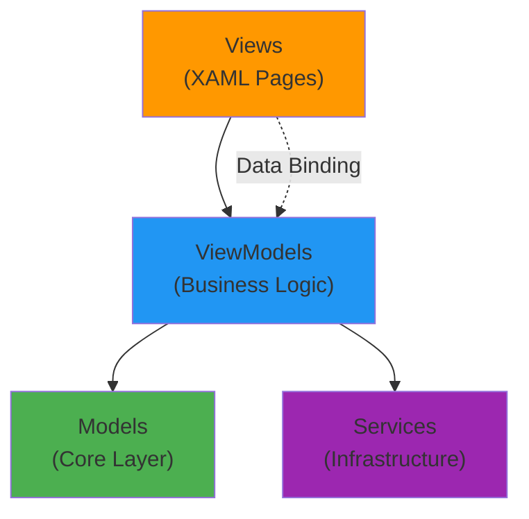

## Overview

The UI application is a **.NET MAUI** (Multi-platform App UI) application that provides a graphical interface for managing APM. It runs on both Windows and Android, with platform-specific features and services.

**Location**: `source/UI/`

**Platforms**: Windows, Android

**Framework**: .NET MAUI with .NET 10.0

**Entry Point**: `source/UI/MauiProgram.cs`

## Purpose

The MAUI application provides:

1. **Printer Management** - Configure thermal and dot matrix printers
2. **Scale Management** - Configure and monitor serial scales
3. **Template Editor** - Create and edit print templates visually
4. **System Logs** - View application logs and debugging information
5. **Settings** - Configure application behavior
6. **Service Control** (Windows) - Start/stop WorkerService
7. **Print Testing** - Test print jobs and preview output

## Architecture Pattern

The UI follows the **MVVM (Model-View-ViewModel)** pattern:



### MVVM Benefits

- **Separation of Concerns** - UI logic separate from business logic
- **Testability** - ViewModels can be unit tested
- **Data Binding** - Automatic UI updates when data changes
- **Platform Abstraction** - Platform-specific code isolated

## MauiProgram.cs - Application Bootstrap

Location: `source/UI/MauiProgram.cs`

### Builder Configuration

```csharp
public static class MauiProgram
{
    public static MauiApp CreateMauiApp()
    {
        var builder = MauiApp.CreateBuilder();
        builder
            .UseMauiApp<App>()
            .UseMauiCommunityToolkit()
            .ConfigureFonts(fonts =>
            {
                fonts.AddFont("OpenSans-Regular.ttf", "OpenSansRegular");
                fonts.AddFont("OpenSans-Semibold.ttf", "OpenSansSemibold");
            });

#if DEBUG
        builder.Logging.AddDebug();
#endif

        // Service registration...
    }
}
```

**Configuration**:
- `.UseMauiApp<App>()` - Sets the main application class
- `.UseMauiCommunityToolkit()` - Adds community toolkit components
- `.ConfigureFonts()` - Registers custom fonts
- Debug logging enabled in development

### Core Service Registration

Location: source/UI/MauiProgram.cs:32

```csharp
// Core services (shared with WorkerService)
builder.Services.AddSingleton<ILoggingService, Logger>();
builder.Services.AddSingleton<ISettingsRepository, SettingsRepository>();
builder.Services.AddSingleton<ITemplateRepository, TemplateRepository>();
builder.Services.AddSingleton<ITicketRenderer, TicketRendererService>();
builder.Services.AddSingleton<IEscPosGenerator, EscPosGeneratorService>();
builder.Services.AddSingleton<TcpIpPrinterClient>();

// Dot matrix printer support
builder.Services.AddSingleton<DotMatrixRendererService>();
builder.Services.AddSingleton<EscPGeneratorService>();
builder.Services.AddSingleton<LocalRawPrinterClient>();
builder.Services.AddSingleton<IppPrinterClient>();

builder.Services.AddSingleton<IPrintService, PrintService>();

// Scale services
builder.Services.AddSingleton<IScaleRepository, JsonScaleRepository>();
```

### Platform-Specific Services

Location: source/UI/MauiProgram.cs:50

#### Windows Platform

```csharp
#if WINDOWS
builder.Services.AddSingleton<IWorkerServiceManager, WindowsWorkerServiceManager>();
builder.Services.AddSingleton<ITrayAppService, WindowsTrayAppService>();
builder.Services.AddSingleton<IPlatformService, WindowsPlatformService>();

// Scale service for dependency resolution
builder.Services.AddSingleton<IScaleService, SerialScaleService>();

// WebSocket server (for controller mode)
builder.Services.AddSingleton<IWebSocketService, WebSocketServerService>();
#endif
```

**Windows-Specific Features**:
- **IWorkerServiceManager** - Control Windows Service (start/stop/status)
- **ITrayAppService** - System tray interaction
- **WindowsPlatformService** - Windows-specific file operations
- **WebSocketServerService** - Can act as server if needed
- **SerialScaleService** - Direct serial port access

#### Android Platform

```csharp
#if ANDROID
builder.Services.AddSingleton<IPlatformService, AndroidPlatformService>();
builder.Services.AddSingleton<IWebSocketService, AndroidWebSocketService>();
#endif
```

**Android-Specific Features**:
- **AndroidPlatformService** - Android file system operations
- **AndroidWebSocketService** - Runs WebSocket server in-app (no separate service)

### ViewModel Registration

Location: source/UI/MauiProgram.cs:68

```csharp
builder.Services.AddTransient<HomeViewModel>();
builder.Services.AddTransient<PrintersViewModel>();
builder.Services.AddTransient<PrinterDetailViewModel>();
builder.Services.AddTransient<ScalesViewModel>();
builder.Services.AddTransient<ScaleDetailViewModel>();
builder.Services.AddTransient<LogsViewModel>();
builder.Services.AddTransient<SettingsViewModel>();
builder.Services.AddTransient<TemplateEditorViewModel>();
```

**Lifetime**: `Transient` - New instance created each time the page is navigated to

### View Registration

Location: source/UI/MauiProgram.cs:77

```csharp
builder.Services.AddTransient<LoginView>();
builder.Services.AddSingleton<AppShell>();
builder.Services.AddTransient<HomePage>();
builder.Services.AddTransient<PrintersPage>();
builder.Services.AddTransient<ScalesPage>();
builder.Services.AddTransient<ScaleDetailPage>();
builder.Services.AddTransient<SettingsPage>();
builder.Services.AddTransient<TemplateEditorPage>();
```

**Lifetimes**:
- Pages: `Transient` - New instance per navigation
- AppShell: `Singleton` - Single shell for app lifetime

### Value Converters

Location: source/UI/MauiProgram.cs:86

```csharp
builder.Services.AddSingleton<InverseBoolConverter>();
builder.Services.AddSingleton<NumericToStringConverter>();
builder.Services.AddSingleton<LogLevelToColorConverter>();
```

**Purpose**: Convert data types for XAML data binding

### Service Provider Exposure

Location: source/UI/MauiProgram.cs:90

```csharp
var app = builder.Build();
Services = app.Services;
return app;
```

```csharp
public static IServiceProvider Services { get; private set; }
```

**Purpose**: Allows static access to services for non-injected scenarios

## Application Structure

### Folder Organization

```
UI/
├── Converters/          # Value converters for data binding
├── Models/              # UI-specific models
├── Platforms/           # Platform-specific implementations
│   ├── Android/
│   │   └── Services/
│   └── Windows/
│       └── Services/
├── Resources/           # Images, fonts, styles
├── Services/            # UI-specific services
├── ViewModels/          # MVVM view models
├── Views/               # XAML pages
├── App.xaml             # Application resources
├── AppShell.xaml        # Navigation shell
└── MauiProgram.cs       # Application bootstrap
```

## Key ViewModels

### HomeViewModel

**Purpose**: Dashboard with system status overview

**Features**:
- Service status (Windows only)
- Quick stats (printer count, scale count)
- Recent logs
- Quick actions

### PrintersViewModel

**Purpose**: Manage printer configurations

**Features**:
- List all configured printers
- Add new printer
- Edit existing printer
- Delete printer
- Test print

**Dependencies**:
- `IPrintService` - Printer operations
- `ISettingsRepository` - Load/save settings
- `ILoggingService` - Logging

### PrinterDetailViewModel

**Purpose**: Configure individual printer settings

**Properties**:
- Printer ID, Name
- Connection Type (TCP, USB, IPP)
- IP Address, Port (for TCP)
- Local Printer Name (for USB)
- URI (for IPP)
- Paper Width
- Character Set
- Copy-to Printers

**Actions**:
- Save configuration
- Test print
- Delete printer

### ScalesViewModel

**Purpose**: Manage scale configurations

**Features**:
- List all configured scales
- Add new scale
- Edit existing scale
- Delete scale
- Start/stop monitoring

**Dependencies**:
- `IScaleRepository` - Scale configuration
- `IScaleService` - Scale communication

### ScaleDetailViewModel

**Purpose**: Configure individual scale settings

**Properties**:
- Scale ID, Name
- COM Port
- Baud Rate
- Data Bits, Parity, Stop Bits
- Protocol settings

**Real-time Data**:
- Current weight
- Stability indicator
- Connection status

**Actions**:
- Save configuration
- Start/stop listening
- Tare scale

### TemplateEditorViewModel

**Purpose**: Edit print templates

**Features**:
- Load template by document type
- Visual template editor
- Section management (header, items, footer)
- Element properties (text, alignment, font)
- Save template
- Preview rendering

**Dependencies**:
- `ITemplateRepository` - Template storage
- `ITicketRenderer` - Preview rendering

### LogsViewModel

**Purpose**: View system logs

**Features**:
- Live log streaming
- Filter by level (Info, Warning, Error)
- Search logs
- Clear logs
- Export logs

**Dependencies**:
- `ILoggingService` - Log access

### SettingsViewModel

**Purpose**: Application settings

**Features**:
- Default paper width
- Default encoding
- Log level
- Auto-start settings (Windows)
- Data directory

## Platform-Specific Services

### Windows Platform Services

#### WindowsWorkerServiceManager

**Purpose**: Control the WorkerService Windows Service

**Interface**:
```csharp
public interface IWorkerServiceManager
{
    Task<ServiceStatus> GetStatusAsync();
    Task StartServiceAsync();
    Task StopServiceAsync();
    Task RestartServiceAsync();
}
```

**Implementation**:
- Uses `System.ServiceProcess.ServiceController`
- Queries service status
- Sends start/stop commands
- Requires appropriate permissions

#### WindowsTrayAppService

**Purpose**: Interact with TrayApp

**Features**:
- Launch TrayApp
- Check if TrayApp is running
- Send messages to TrayApp

#### WindowsPlatformService

**Purpose**: Windows-specific operations

**Features**:
- File system access with Windows paths
- Registry access
- Process management

### Android Platform Services

#### AndroidPlatformService

**Purpose**: Android-specific operations

**Features**:
- Android file system access
- Storage permissions
- Intent handling

#### AndroidWebSocketService

**Purpose**: Run WebSocket server within the Android app

**Differences from Windows**:
- No separate service process
- Runs in app's background
- Lifecycle tied to app (can be killed by OS)
- Requires background service permissions

## Navigation

APM uses **Shell Navigation** for routing:

### AppShell.xaml

```xml
<Shell>
    <FlyoutItem Title="Home" Icon="home.png">
        <ShellContent ContentTemplate="{DataTemplate local:HomePage}" />
    </FlyoutItem>
    
    <FlyoutItem Title="Printers" Icon="printer.png">
        <ShellContent ContentTemplate="{DataTemplate local:PrintersPage}" />
    </FlyoutItem>
    
    <FlyoutItem Title="Scales" Icon="scale.png">
        <ShellContent ContentTemplate="{DataTemplate local:ScalesPage}" />
    </FlyoutItem>
    
    <FlyoutItem Title="Templates" Icon="template.png">
        <ShellContent ContentTemplate="{DataTemplate local:TemplateEditorPage}" />
    </FlyoutItem>
    
    <FlyoutItem Title="Logs" Icon="logs.png">
        <ShellContent ContentTemplate="{DataTemplate local:LogsPage}" />
    </FlyoutItem>
    
    <FlyoutItem Title="Settings" Icon="settings.png">
        <ShellContent ContentTemplate="{DataTemplate local:SettingsPage}" />
    </FlyoutItem>
</Shell>
```

**Navigation Methods**:
```csharp
// Navigate to route
await Shell.Current.GoToAsync("//printers");

// Navigate with parameters
await Shell.Current.GoToAsync($"printerdetail?printerId={id}");

// Go back
await Shell.Current.GoToAsync("..");
```

## Data Binding

### Example: Printer List Binding

**ViewModel**:
```csharp
public class PrintersViewModel : INotifyPropertyChanged
{
    private ObservableCollection<PrinterSettings> _printers;
    
    public ObservableCollection<PrinterSettings> Printers
    {
        get => _printers;
        set
        {
            _printers = value;
            OnPropertyChanged();
        }
    }
    
    public async Task LoadPrintersAsync()
    {
        var printers = await _printService.GetAllPrinterSettingsAsync();
        Printers = new ObservableCollection<PrinterSettings>(printers);
    }
}
```

**View (XAML)**:
```xml
<CollectionView ItemsSource="{Binding Printers}">
    <CollectionView.ItemTemplate>
        <DataTemplate>
            <Frame>
                <StackLayout>
                    <Label Text="{Binding Name}" FontSize="18" FontAttributes="Bold" />
                    <Label Text="{Binding ConnectionType}" />
                    <Label Text="{Binding IpAddress}" />
                </StackLayout>
            </Frame>
        </DataTemplate>
    </CollectionView.ItemTemplate>
</CollectionView>
```

## Dependency Injection in Views

### Constructor Injection

```csharp
public partial class PrintersPage : ContentPage
{
    private readonly PrintersViewModel _viewModel;
    
    public PrintersPage(PrintersViewModel viewModel)
    {
        InitializeComponent();
        _viewModel = viewModel;
        BindingContext = _viewModel;
    }
    
    protected override async void OnAppearing()
    {
        base.OnAppearing();
        await _viewModel.LoadPrintersAsync();
    }
}
```

**Registered in MauiProgram.cs**:
```csharp
builder.Services.AddTransient<PrintersPage>();
builder.Services.AddTransient<PrintersViewModel>();
```

## Community Toolkit Components

APM uses **MAUI Community Toolkit** for enhanced functionality:

### Converters
- `InverseBoolConverter` - Invert boolean values
- `IsNotNullOrEmptyConverter` - Check for null/empty strings

### Behaviors
- `EventToCommandBehavior` - Convert events to commands
- `ValidationBehavior` - Input validation

### Markup Extensions
- `TranslateExtension` - Localization support

## Platform Differences

### Windows

**Features**:
- Full access to WorkerService control
- System tray integration
- All printer connection types (TCP, USB, IPP)
- Direct serial port access
- Full file system access

**Limitations**:
- Desktop only (no mobile)

### Android

**Features**:
- Mobile-friendly UI
- TCP printer support
- Built-in WebSocket server
- Background service

**Limitations**:
- No USB printer support (without OTG adapter)
- Limited serial port access
- No Windows Service control
- File system restrictions
- Background service limitations (can be killed by OS)

## Deployment

### Windows Deployment

**Output**: `UI.exe` (self-contained or framework-dependent)

**Distribution**:
- MSIX installer (Microsoft Store)
- Traditional installer (Inno Setup, WiX)
- Portable executable

**Requirements**:
- .NET 10.0 Runtime (if framework-dependent)
- Windows 10/11

### Android Deployment

**Output**: `com.appsiel.printmanager.apk` (or AAB for Play Store)

**Distribution**:
- Google Play Store
- Direct APK installation (sideloading)

**Requirements**:
- Android 7.0+ (API 24+)
- Storage permissions
- Network permissions
- Background service permissions

## Testing

### Unit Testing ViewModels

```csharp
public class PrintersViewModelTests
{
    [Fact]
    public async Task LoadPrinters_PopulatesList()
    {
        // Arrange
        var mockPrintService = new Mock<IPrintService>();
        mockPrintService.Setup(s => s.GetAllPrinterSettingsAsync())
            .ReturnsAsync(new List<PrinterSettings> { /* test data */ });
        
        var viewModel = new PrintersViewModel(mockPrintService.Object);
        
        // Act
        await viewModel.LoadPrintersAsync();
        
        // Assert
        Assert.NotEmpty(viewModel.Printers);
    }
}
```

### UI Testing

MAUI supports UI testing with:
- **Appium** - Cross-platform UI automation
- **Platform-specific**: UITest (iOS), Espresso (Android), WinAppDriver (Windows)

## Performance Optimization

1. **Lazy Loading** - ViewModels created on-demand
2. **CollectionView** - Virtualized list rendering
3. **Async Operations** - Non-blocking UI
4. **Image Caching** - Reuse loaded images
5. **Compiled Bindings** - Faster data binding (when possible)

## Next Steps

- [Worker Service](/architecture/worker-service) - Background service integration
- [Core Components](/architecture/components) - Services and interfaces
- [System Overview](/architecture/overview) - Complete system architecture
