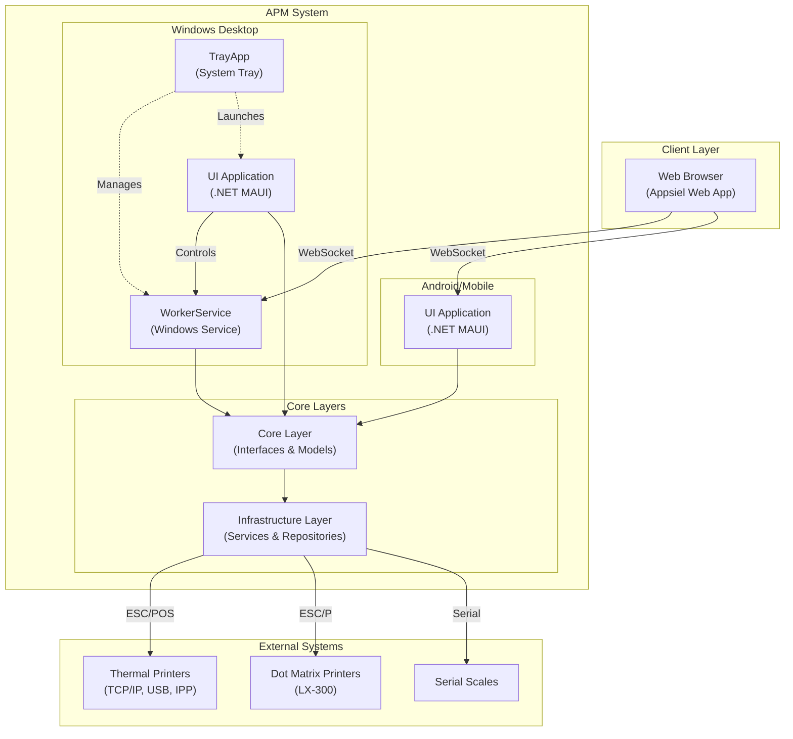
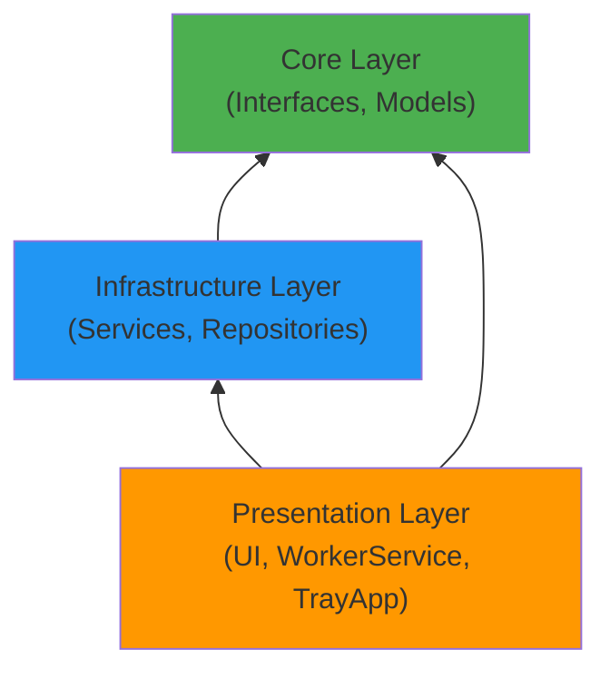
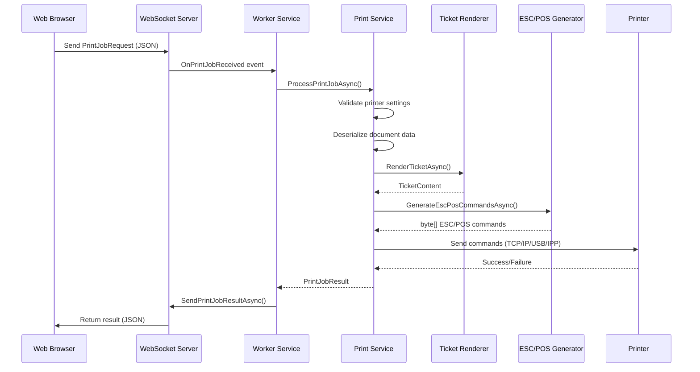
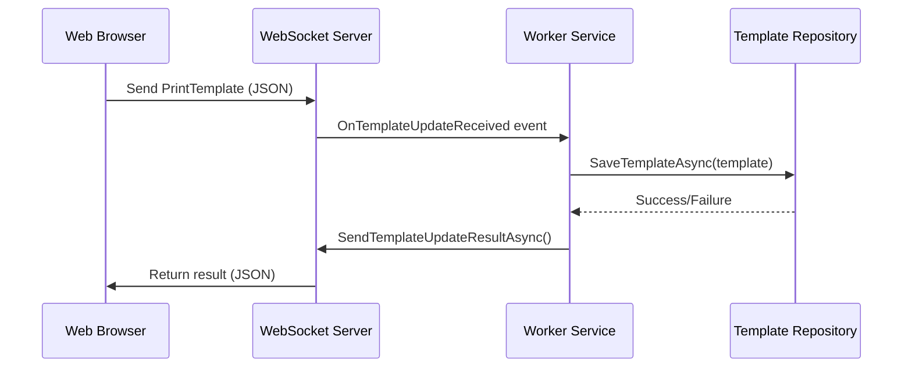
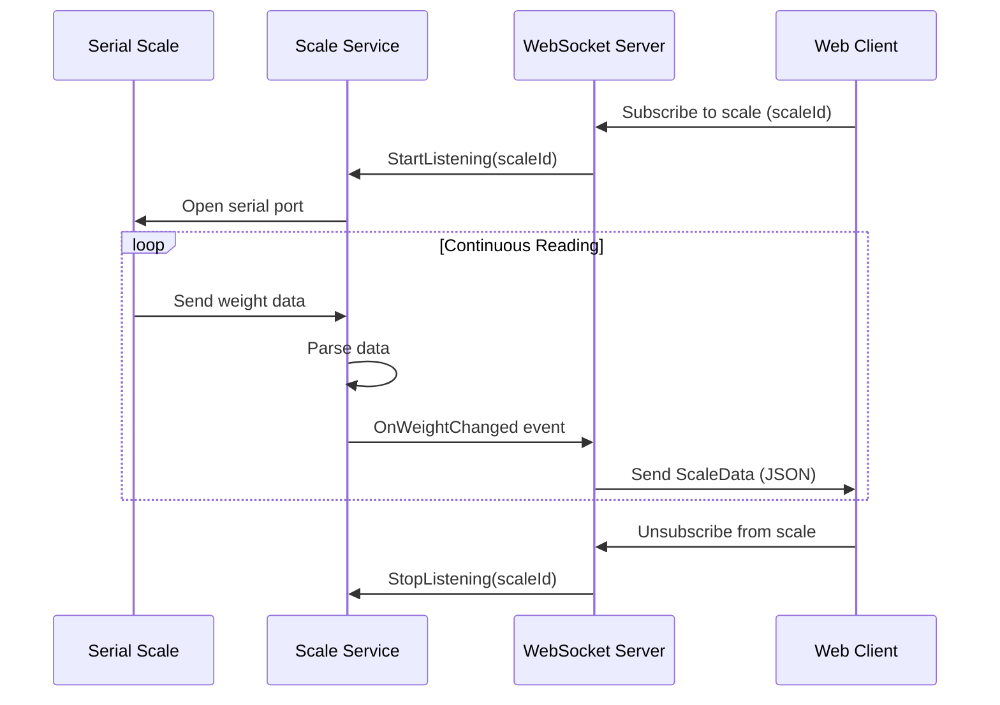

## Introduction

Appsiel Print Manager (APM) is a cross-platform print management system built with .NET MAUI and C#. The system follows a clean, layered architecture pattern with clear separation of concerns between business logic, infrastructure, and presentation layers.

## Architecture Diagram



## System Components

The APM system consists of six main components:

### 1. Core Layer
- **Purpose**: Domain models and contracts
- **Location**: `source/Core/`
- **Dependencies**: None (pure .NET)
- **Key Elements**:
  - Interface definitions (`IWebSocketService`, `IPrintService`, `ITicketRenderer`, etc.)
  - Domain models (`PrintJobRequest`, `PrinterSettings`, `ScaleData`, etc.)
  - Enumerations and data contracts

### 2. Infrastructure Layer
- **Purpose**: Concrete implementations of core interfaces
- **Location**: `source/Infraestructure/`
- **Dependencies**: Core layer only
- **Key Services**:
  - `WebSocketServerService` - WebSocket server implementation
  - `PrintService` - Print job orchestration
  - `TicketRendererService` - Template rendering engine
  - `EscPosGeneratorService` - ESC/POS command generation (thermal printers)
  - `EscPGeneratorService` - ESC/P command generation (dot matrix printers)
  - `SerialScaleService` - Serial scale communication
  - Repository implementations for settings and templates

### 3. WorkerService (Windows Service)
- **Purpose**: Background print server for Windows
- **Location**: `source/WorkerService/`
- **Platform**: Windows only
- **Key Features**:
  - Runs as a Windows Service (always-on)
  - Hosts WebSocket server on port 7000
  - Processes print jobs from web clients
  - Manages template updates
  - Validates and ensures default templates exist

### 4. UI Application (.NET MAUI)
- **Purpose**: Cross-platform management interface
- **Location**: `source/UI/`
- **Platforms**: Windows, Android
- **Key Features**:
  - Printer configuration and management
  - Scale configuration and monitoring
  - Template editor
  - System logs viewer
  - Settings management
  - Platform-specific services (Windows: service management, Android: WebSocket client)

### 5. TrayApp (System Tray)
- **Purpose**: Windows system tray integration
- **Location**: `source/TrayApp/`
- **Platform**: Windows only (WPF)
- **Key Features**:
  - System tray icon and menu
  - WorkerService start/stop control
  - Launch UI application
  - Service status monitoring

### 6. ConsoleApp
- **Purpose**: Command-line testing and debugging
- **Location**: `source/ConsoleApp/`
- **Platform**: All platforms

## Layered Architecture

APM follows the **Clean Architecture** pattern with clear dependency rules:



### Dependency Rules

1. **Core Layer** has no dependencies - it defines the contracts
2. **Infrastructure Layer** depends only on Core - it implements the contracts
3. **Presentation Layer** depends on both Core and Infrastructure
4. All dependencies point inward toward Core

### Benefits

- **Testability**: Core business logic can be tested independently
- **Maintainability**: Changes to infrastructure don't affect core logic
- **Flexibility**: Easy to swap implementations (e.g., different storage providers)
- **Platform Independence**: Core layer is platform-agnostic

## Communication Flow

### Print Job Flow



### Template Update Flow



### Scale Data Flow



## Deployment Models

### Windows Deployment

```
┌─────────────────────────────────────┐
│         Windows Machine              │
├─────────────────────────────────────┤
│                                      │
│  ┌──────────────────────────────┐   │
│  │  WorkerService.exe           │   │
│  │  (Windows Service)           │   │
│  │  - WebSocket Server :7000    │   │
│  │  - Auto-start on boot        │   │
│  └──────────────────────────────┘   │
│                                      │
│  ┌──────────────────────────────┐   │
│  │  TrayApp.exe                 │   │
│  │  (System Tray)               │   │
│  │  - Auto-start on login       │   │
│  └──────────────────────────────┘   │
│                                      │
│  ┌──────────────────────────────┐   │
│  │  UI.exe                      │   │
│  │  (.NET MAUI App)             │   │
│  │  - On-demand launch          │   │
│  └──────────────────────────────┘   │
│                                      │
└─────────────────────────────────────┘
```

### Android Deployment

```
┌─────────────────────────────────────┐
│        Android Device                │
├─────────────────────────────────────┤
│                                      │
│  ┌──────────────────────────────┐   │
│  │  APM.apk                     │   │
│  │  (.NET MAUI App)             │   │
│  │  - WebSocket Server          │   │
│  │  - Full UI                   │   │
│  │  - Background service        │   │
│  └──────────────────────────────┘   │
│                                      │
└─────────────────────────────────────┘
```

## Data Storage

APM uses JSON-based file storage for configuration:

- **Printer Settings**: `printers.json` - Stores printer configurations
- **Templates**: Individual JSON files per document type
- **Dot Matrix Templates**: Separate JSON files for matrix printer layouts
- **Scale Configuration**: `scales.json` - Serial scale settings
- **Logs**: File-based logging

### Storage Location

- **Windows**: `%APPDATA%\AppsielPrintManager\`
- **Android**: Application-specific storage

## Technology Stack

- **Framework**: .NET 10.0
- **UI Framework**: .NET MAUI (Multi-platform App UI)
- **Windows Service**: Microsoft.Extensions.Hosting.WindowsServices
- **WebSocket**: WatsonWebsocket library
- **Barcode/QR**: ZXing.Net with SkiaSharp
- **Image Processing**: SkiaSharp
- **Serial Communication**: System.IO.Ports
- **DI Container**: Microsoft.Extensions.DependencyInjection

## Security Considerations

1. **Local Network Only**: WebSocket server binds to localhost or local network
2. **No Authentication**: Designed for trusted local network environments
3. **Service Isolation**: Windows Service runs with appropriate permissions
4. **File System Access**: Controlled access to configuration directories

## Next Steps

- [Core Components](/architecture/components) - Detailed component documentation
- [Worker Service](/architecture/worker-service) - Windows Service deep dive
- [MAUI Application](/architecture/maui-application) - UI application architecture
