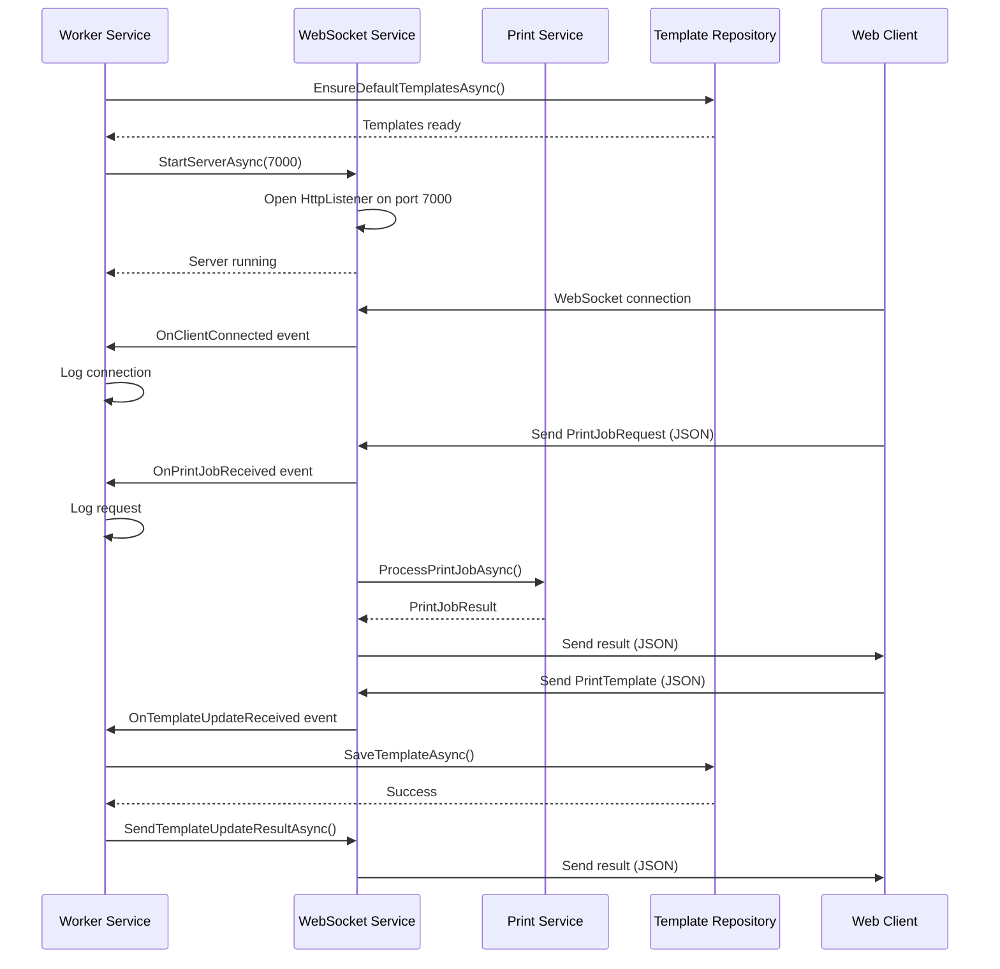

## Overview

The WorkerService is a **Windows Service** that runs continuously in the background on Windows machines. It acts as the print server, hosting a WebSocket endpoint that accepts connections from web browsers and processes print jobs.

**Location**: `source/WorkerService/`

**Platform**: Windows only (.NET 10.0)

**Entry Point**: `source/WorkerService/Program.cs`

## Purpose

The WorkerService provides:

1. **Always-On WebSocket Server** - Listens on port 7000 for web client connections
2. **Print Job Processing** - Handles incoming print requests from Appsiel web application
3. **Template Management** - Accepts and stores template updates from remote clients
4. **Scale Data Broadcasting** - Streams serial scale readings to subscribed clients
5. **Background Execution** - Runs without user interaction, starts on system boot

## Project Configuration

**WorkerService.csproj**:

```xml
<Project Sdk="Microsoft.NET.Sdk.Worker">
  <PropertyGroup>
    <TargetFramework>net10.0</TargetFramework>
    <OutputType>Exe</OutputType>
    <DefineConstants>WINDOWS;$(DefineConstants)</DefineConstants>
  </PropertyGroup>

  <ItemGroup>
    <PackageReference Include="Microsoft.Extensions.Hosting" Version="10.0.1" />
    <PackageReference Include="Microsoft.Extensions.Hosting.WindowsServices" Version="10.0.1" />
  </ItemGroup>

  <ItemGroup>
    <ProjectReference Include="..\Core\Core.csproj" />
    <ProjectReference Include="..\Infraestructure\Infraestructure.csproj" />
  </ItemGroup>
</Project>
```

**Key Dependencies**:
- `Microsoft.Extensions.Hosting` - Generic host infrastructure
- `Microsoft.Extensions.Hosting.WindowsServices` - Windows Service integration
- Core and Infrastructure layers

## Program.cs - Service Configuration

Location: `source/WorkerService/Program.cs`

### Host Builder Setup

```csharp
var builder = Host.CreateDefaultBuilder(args)
    .UseWindowsService() // Configure to run as Windows Service
    .ConfigureServices((hostContext, services) =>
    {
        // Service registration
    });
```

**Key Configuration**:
- `.UseWindowsService()` - Enables Windows Service hosting
- Creates default builder with logging, configuration, and DI

### Dependency Injection Registration

The Program.cs registers all required services (source/WorkerService/Program.cs:10):

```csharp
.ConfigureServices((hostContext, services) =>
{
    // Core services
    services.AddSingleton<ILoggingService, Logger>();
    services.AddSingleton<IWebSocketService, WebSocketServerService>();
    services.AddSingleton<ISettingsRepository, SettingsRepository>();
    services.AddSingleton<ITemplateRepository, TemplateRepository>();
    services.AddSingleton<ITicketRenderer, TicketRendererService>();
    services.AddSingleton<IEscPosGenerator, EscPosGeneratorService>();
    services.AddSingleton<TcpIpPrinterClient>();

    // Dot matrix printer support
    services.AddSingleton<DotMatrixRendererService>();
    services.AddSingleton<EscPGeneratorService>();
    services.AddSingleton<LocalRawPrinterClient>();
    services.AddSingleton<IppPrinterClient>();

    services.AddSingleton<IPrintService, PrintService>();

    // Scale services
    services.AddSingleton<IScaleRepository, JsonScaleRepository>();
    services.AddSingleton<IScaleService, SerialScaleService>();

    // Register the background worker
    services.AddHostedService<Worker>();
});
```

**Service Lifetimes**:
- All services use **Singleton** lifetime for shared state and performance
- `Worker` is registered as a **HostedService** to run in background

### Service Startup

```csharp
var host = builder.Build();
host.Run();
```

This builds the host and runs it indefinitely (until service is stopped).

## Worker.cs - Background Service

Location: `source/WorkerService/Worker.cs`

### Class Definition

```csharp
public class Worker : BackgroundService
{
    private readonly ILogger<Worker> _logger;
    private readonly IWebSocketService _webSocketService;
    private readonly ITemplateRepository _templateRepository;
    private const int WebSocketPort = 7000;
}
```

**Inheritance**: `BackgroundService` (from Microsoft.Extensions.Hosting)
- Provides lifecycle hooks for long-running operations
- `ExecuteAsync` method runs in background

**Dependencies** (injected via constructor at source/WorkerService/Worker.cs:13):
- `ILogger<Worker>` - Logging framework
- `IWebSocketService` - WebSocket server implementation
- `ITemplateRepository` - Template storage

### Constructor and Event Subscription

```csharp
public Worker(ILogger<Worker> logger, 
              IWebSocketService webSocketService, 
              ITemplateRepository templateRepository)
{
    _logger = logger;
    _webSocketService = webSocketService;
    _templateRepository = templateRepository;

    // Subscribe to WebSocket events
    _webSocketService.OnClientConnected += (sender, clientId) =>
    {
        _logger.LogInformation($"[WebSocket] Cliente conectado: {clientId}");
        return Task.CompletedTask;
    };
    
    _webSocketService.OnClientDisconnected += (sender, clientId) =>
    {
        _logger.LogInformation($"[WebSocket] Cliente desconectado: {clientId}");
        return Task.CompletedTask;
    };
    
    _webSocketService.OnPrintJobReceived += async (sender, args) =>
    {
        var request = args.Message;
        var clientId = args.ClientId;
        _logger.LogInformation(
            $"[WebSocket] PrintJobRequest recibido de {clientId} para JobId: {request.JobId}");
    };
    
    _webSocketService.OnTemplateUpdateReceived += async (sender, args) =>
    {
        await HandleTemplateUpdate(args);
    };
}
```

**Event Handlers**:
1. **OnClientConnected** - Logs new WebSocket connections
2. **OnClientDisconnected** - Logs client disconnections
3. **OnPrintJobReceived** - Logs print job requests (actual processing happens in WebSocketService → PrintService)
4. **OnTemplateUpdateReceived** - Saves template updates and sends results back

### Template Update Handler

Location: source/WorkerService/Worker.cs:37

```csharp
_webSocketService.OnTemplateUpdateReceived += async (sender, args) =>
{
    var template = args.Message;
    var clientId = args.ClientId;
    _logger.LogInformation(
        $"[WebSocket] Solicitud de actualización de plantilla recibida de {clientId} para: {template.DocumentType}");

    try
    {
        // Save template directly without confirmation in Windows
        await _templateRepository.SaveTemplateAsync(template);
        _logger.LogInformation(
            $"[WebSocket] Plantilla '{template.DocumentType}' actualizada exitosamente por solicitud remota.");

        // Send success response to client
        var result = new TemplateUpdateResult
        {
            DocumentType = template.DocumentType,
            Success = true,
            Message = $"Plantilla '{template.DocumentType}' actualizada exitosamente en Windows."
        };
        await _webSocketService.SendTemplateUpdateResultAsync(clientId, result);
    }
    catch (Exception ex)
    {
        _logger.LogError($"Error al procesar la actualización remota de plantilla: {ex.Message}", ex);

        // Send error response to client
        var result = new TemplateUpdateResult
        {
            DocumentType = template.DocumentType,
            Success = false,
            Message = $"Error en Windows: {ex.Message}"
        };
        await _webSocketService.SendTemplateUpdateResultAsync(clientId, result);
    }
};
```

**Template Update Flow**:
1. Receive template from web client
2. Save to local storage via `ITemplateRepository`
3. Send success/failure result back to client
4. No user confirmation required (auto-save)

### ExecuteAsync - Main Service Loop

Location: source/WorkerService/Worker.cs:74

```csharp
protected override async Task ExecuteAsync(CancellationToken stoppingToken)
{
    _logger.LogInformation("WorkerService iniciado. Intentando iniciar el servidor WebSocket.");

    try
    {
        // Validate/create default templates on startup
        await _templateRepository.EnsureDefaultTemplatesAsync();
        _logger.LogInformation("Plantillas predeterminadas validadas/creadas exitosamente.");

        // Start WebSocket server
        await _webSocketService.StartServerAsync(WebSocketPort);
        _logger.LogInformation(
            $"Servidor WebSocket {(_webSocketService.IsRunning ? "iniciado" : "falló al iniciar")} en puerto {WebSocketPort}.");
    }
    catch (Exception ex)
    {
        _logger.LogError(
            $"Error al iniciar el servidor WebSocket en WorkerService: {ex.Message}", ex);
    }

    // Keep service running
    while (!stoppingToken.IsCancellationRequested)
    {
        _logger.LogInformation("Worker running at: {time}", DateTimeOffset.Now);
        await Task.Delay(TimeSpan.FromMinutes(1), stoppingToken);
    }

    // Cleanup on shutdown
    _logger.LogInformation("WorkerService detenido. Deteniendo el servidor WebSocket.");
    if (_webSocketService.IsRunning)
    {
        await _webSocketService.StopServerAsync();
    }
}
```

**Startup Sequence**:
1. **Ensure Default Templates** - Creates missing templates from defaults
2. **Start WebSocket Server** - Binds to port 7000 and begins accepting connections
3. **Enter Main Loop** - Logs heartbeat every minute
4. **Wait for Cancellation** - Runs until service stop is requested

**Shutdown Sequence**:
1. Cancellation token is triggered
2. Exit main loop
3. Stop WebSocket server gracefully
4. Service terminates

## WebSocket Server Flow



## Service Installation

The WorkerService is installed as a Windows Service using the Windows Service Manager (sc.exe) or installers.

### Installation Commands

```powershell
# Create service
sc.exe create "AppsielPrintManagerWorker" binPath= "C:\Path\To\WorkerService.exe"

# Start service
sc.exe start "AppsielPrintManagerWorker"

# Configure auto-start
sc.exe config "AppsielPrintManagerWorker" start= auto

# Delete service
sc.exe delete "AppsielPrintManagerWorker"
```

### Service Properties

- **Service Name**: `WorkerService` (or custom name)
- **Display Name**: Appsiel Print Manager Worker
- **Startup Type**: Automatic
- **Run As**: Local System or specific user account
- **Recovery**: Restart on failure

## Communication Protocols

### WebSocket Message Format

All messages are JSON objects with a `type` field:

**Print Job Request**:
```json
{
  "type": "printJob",
  "jobId": "unique-job-id",
  "printerId": "printer-1",
  "documentType": "ticket_venta",
  "document": { /* document data */ },
  "paperWidth": 80,
  "encoding": "utf-8"
}
```

**Template Update Request**:
```json
{
  "type": "templateUpdate",
  "templateId": "template-id",
  "documentType": "ticket_venta",
  "version": "1.0",
  "sections": [ /* template sections */ ]
}
```

**Scale Subscription**:
```json
{
  "type": "subscribeScale",
  "scaleId": "scale-1"
}
```

### Response Format

**Print Job Result**:
```json
{
  "type": "printJobResult",
  "jobId": "unique-job-id",
  "status": "DONE",
  "errorMessage": null
}
```

**Template Update Result**:
```json
{
  "type": "templateUpdateResult",
  "documentType": "ticket_venta",
  "success": true,
  "message": "Plantilla actualizada exitosamente"
}
```

**Scale Data**:
```json
{
  "type": "scaleData",
  "scaleId": "scale-1",
  "weight": 1.234,
  "unit": "kg",
  "stable": true,
  "timestamp": "2026-03-03T10:15:30Z"
}
```

## Logging

The Worker uses both:
1. **Microsoft.Extensions.Logging** - Framework logging (ILogger&lt;Worker&gt;)
2. **ILoggingService** - Custom logging to files

**Log Levels**:
- Information - Normal operations
- Warning - Recoverable issues
- Error - Failures and exceptions

**Log Locations**:
- Windows Event Log (when running as service)
- Console output (when running as console app)
- File logs via ILoggingService

## Error Handling

### Startup Errors

- Template initialization failures are logged but don't stop the service
- WebSocket server failures are logged and service continues (with degraded functionality)

### Runtime Errors

- Print job errors are caught and returned to client in PrintJobResult
- Template update errors are caught and returned in TemplateUpdateResult
- Client disconnections are handled gracefully

### Recovery

- Service can be restarted via Windows Service Manager
- WebSocket server can be restarted without full service restart
- Individual print job failures don't affect other jobs

## Performance Considerations

1. **Singleton Services** - Shared state across all requests
2. **Async/Await** - Non-blocking I/O operations
3. **Concurrent Clients** - Multiple simultaneous WebSocket connections
4. **Message Queue** - Queued message processing in WebSocketService
5. **Background Processing** - Print jobs processed asynchronously

## Security

1. **Local Network Only** - WebSocket binds to local addresses
2. **No Authentication** - Designed for trusted environments
3. **Service Permissions** - Runs with appropriate Windows permissions
4. **File Access** - Controlled access to printer and template files

## Monitoring

**Service Status**:
- Check via Windows Service Manager
- Query via TrayApp
- Monitor via UI application (Windows platform service manager)

**Health Checks**:
- WebSocket server IsRunning property
- Client count monitoring
- Log file analysis

## Troubleshooting

### Service Won't Start

1. Check Windows Event Viewer for errors
2. Verify port 7000 is not in use
3. Ensure service has proper permissions
4. Check dependencies are installed

### WebSocket Connection Failures

1. Verify service is running
2. Check firewall rules for port 7000
3. Test with telnet/curl to port 7000
4. Review WebSocket server logs

### Print Jobs Failing

1. Check printer connectivity
2. Verify printer settings in configuration
3. Review print service logs
4. Test with simple document

## Next Steps

- [MAUI Application](/architecture/maui-application) - UI for managing the service
- [Core Components](/architecture/components) - Understanding the services used
- [System Overview](/architecture/overview) - Overall system architecture
