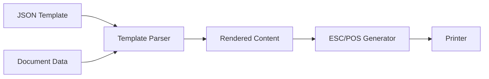

## Overview

APM uses a powerful JSON-based template system that separates document structure from data. Templates define the layout, formatting, and styling of printed documents, while business data is injected at print time.

## Template Architecture



## Template Structure

### Core Models

```csharp Core/Models/PrintTemplate.cs
public class PrintTemplate
{
    public string? TemplateId { get; set; }                           // Unique identifier
    public string? Name { get; set; }                                 // Display name
    public string? DocumentType { get; set; }                         // e.g., "ticket_venta"
    public List<TemplateSection> Sections { get; set; }               // Ordered sections
    public Dictionary<string, string> GlobalStyles { get; set; }      // Global formatting
}

public class TemplateSection
{
    public string? Name { get; set; }                                 // Section identifier
    public string? Type { get; set; }                                 // "Static", "Table", "Repeated"
    public string? DataSource { get; set; }                           // Data path (e.g., "Sale.Items")
    public string? Format { get; set; }                               // Section-wide format
    public string? Align { get; set; }                                // Section-wide alignment
    public int? Order { get; set; }                                   // Print sequence
    public List<TemplateElement> Elements { get; set; }               // Section elements
}

public class TemplateElement
{
    public string? Type { get; set; }                                 // "Text", "Barcode", "QR", "Image", "Line"
    public string? Label { get; set; }                                // Static prefix text
    public string? Source { get; set; }                               // Data property path
    public string? StaticValue { get; set; }                          // Fixed value
    public string? Format { get; set; }                               // Formatting flags
    public string? Align { get; set; }                                // "Left", "Center", "Right"
    public string? HeaderFormat { get; set; }                         // Table header format
    public string? HeaderAlign { get; set; }                          // Table header alignment
    public int? WidthPercentage { get; set; }                         // Column width (tables)
    public int? Columns { get; set; }                                 // Multi-column layout
    public int? BarWidth { get; set; }                                // Barcode module width (1-5)
    public int? Height { get; set; }                                  // Barcode/image height (1-255)
    public int? Size { get; set; }                                    // QR code size (1-16)
    public int? Order { get; set; }                                   // Element position
    public Dictionary<string, string> Properties { get; set; }        // Custom properties
}
```

## Section Types

### Static Sections

Sequential elements rendered in order.

```json
{
  "Name": "Header",
  "Type": "Static",
  "Align": "Center",
  "Elements": [
    {
      "Type": "Text",
      "StaticValue": "APPSIEL CLOUD POS",
      "Format": "Bold Size2"
    },
    {
      "Type": "Text",
      "Source": "Store.Name",
      "Format": "Bold"
    },
    {
      "Type": "Text",
      "Source": "Store.Address"
    },
    {
      "Type": "Line"
    }
  ]
}
```

### Table Sections

Columnar layout for repeating data.

```json
{
  "Name": "Items",
  "Type": "Table",
  "DataSource": "Sale.Items",
  "Elements": [
    {
      "Label": "Cant",
      "Source": "Quantity",
      "WidthPercentage": 15,
      "Align": "Left",
      "HeaderFormat": "Bold"
    },
    {
      "Label": "Producto",
      "Source": "ProductName",
      "WidthPercentage": 55,
      "Align": "Left",
      "HeaderFormat": "Bold"
    },
    {
      "Label": "Total",
      "Source": "Total",
      "WidthPercentage": 30,
      "Align": "Right",
      "HeaderFormat": "Bold",
      "HeaderAlign": "Right"
    }
  ]
}
```

<Info>
`WidthPercentage` values should sum to 100 for optimal column distribution.
</Info>

### Repeated Sections

Loop over simple arrays or lists.

```json
{
  "Name": "Footer Messages",
  "Type": "Repeated",
  "DataSource": "Footer",
  "Align": "Center",
  "Elements": [
    {
      "Type": "Text",
      "Source": ".",
      "Format": "FontB"
    }
  ]
}
```

<Note>
Use `"Source": "."` to reference the current item in a repeated section.
</Note>

## Element Types

### Text

Display static or dynamic text.

```json
{
  "Type": "Text",
  "Label": "Total: ",
  "Source": "Sale.Total",
  "Format": "Bold Large",
  "Align": "Right"
}
```

### Line

Horizontal separator.

```json
{
  "Type": "Line"
}
```

### Barcode

Linear barcodes (CODE128, EAN13, etc.).

```json
{
  "Type": "Barcode",
  "Source": "Sale.Number",
  "Height": 50,
  "BarWidth": 2,
  "Properties": {
    "Hri": "true"
  }
}
```

### QR Code

2D QR codes for URLs or data.

```json
{
  "Type": "QR",
  "Source": "Sale.InvoiceUrl",
  "Size": 4,
  "Align": "Center"
}
```

### Image

Embedded logos or graphics.

```json
{
  "Type": "Image",
  "Source": "Store.LogoPath",
  "Align": "Center"
}
```

## Formatting Options

Format strings support multiple space-separated flags:

### Font Selection

| Format | Description | Characters (80mm) |
|--------|-------------|-----------------|
| `FontA` | Standard font | 48 characters |
| `FontB` | Compressed font | 64 characters |

### Text Styles

| Format | Description |
|--------|--------------|
| `Bold` | Bold/emphasized text |
| `Underline` | Underlined text |

### Size Modifiers

| Format | Description |
|--------|--------------|
| `Large` | Double height |
| `DoubleWidth` | Double width |
| `Size2` - `Size8` | Proportional scaling (2x-8x) |

### Combining Formats

```json
{
  "Format": "Bold Large Center"
}
```

```json
{
  "Format": "FontB Size3 Underline"
}
```

## Alignment

| Value | Description |
|-------|-------------|
| `Left` | Left-aligned (default) |
| `Center` | Centered |
| `Right` | Right-aligned |

<Info>
Alignment can be set at section, element, or header level. Element-level alignment overrides section-level.
</Info>

## Data Binding

### Property Paths

Use dot notation to access nested properties:

```json
{
  "Source": "Sale.Customer.Name"
}
```

For the data structure:

```json
{
  "Sale": {
    "Customer": {
      "Name": "Juan Pérez"
    }
  }
}
```

### Current Item Reference

In `Repeated` sections, use `"."` to reference the current item:

```json
{
  "Type": "Repeated",
  "DataSource": "Messages",
  "Elements": [
    {
      "Type": "Text",
      "Source": "."
    }
  ]
}
```

For data:

```json
{
  "Messages": [
    "Gracias por su compra",
    "Vuelva pronto",
    "www.ejemplo.com"
  ]
}
```

### Table Data Binding

In `Table` sections, `Source` references properties of each item:

```json
{
  "Type": "Table",
  "DataSource": "Sale.Items",
  "Elements": [
    {
      "Source": "ProductName"
    },
    {
      "Source": "Quantity"
    },
    {
      "Source": "Total"
    }
  ]
}
```

## Complete Example Template

```json
{
  "DocumentType": "ticket_venta",
  "Name": "Plantilla Estándar",
  "Sections": [
    {
      "Name": "Header",
      "Type": "Static",
      "Order": 1,
      "Align": "Center",
      "Elements": [
        {
          "Type": "Text",
          "StaticValue": "APPSIEL CLOUD POS",
          "Format": "Bold Size2"
        },
        {
          "Type": "Text",
          "Source": "Store.Name",
          "Format": "Bold"
        },
        {
          "Type": "Text",
          "Source": "Store.Address",
          "Format": "FontB"
        },
        {
          "Type": "Text",
          "Label": "Tel: ",
          "Source": "Store.Phone",
          "Format": "FontB"
        },
        {
          "Type": "Line"
        }
      ]
    },
    {
      "Name": "Sale Info",
      "Type": "Static",
      "Order": 2,
      "Elements": [
        {
          "Type": "Text",
          "Label": "Factura: ",
          "Source": "Sale.Number",
          "Format": "Bold"
        },
        {
          "Type": "Text",
          "Label": "Fecha: ",
          "Source": "Sale.Date"
        },
        {
          "Type": "Text",
          "Label": "Cliente: ",
          "Source": "Sale.Customer.Name"
        },
        {
          "Type": "Line"
        }
      ]
    },
    {
      "Name": "Items",
      "Type": "Table",
      "Order": 3,
      "DataSource": "Sale.Items",
      "Elements": [
        {
          "Label": "Cant",
          "Source": "Quantity",
          "WidthPercentage": 15,
          "Align": "Left",
          "HeaderFormat": "Bold",
          "HeaderAlign": "Left"
        },
        {
          "Label": "Producto",
          "Source": "ProductName",
          "WidthPercentage": 50,
          "Align": "Left",
          "HeaderFormat": "Bold"
        },
        {
          "Label": "Precio",
          "Source": "Price",
          "WidthPercentage": 15,
          "Align": "Right",
          "HeaderFormat": "Bold",
          "HeaderAlign": "Right"
        },
        {
          "Label": "Total",
          "Source": "Total",
          "WidthPercentage": 20,
          "Align": "Right",
          "HeaderFormat": "Bold",
          "HeaderAlign": "Right"
        }
      ]
    },
    {
      "Name": "Totals",
      "Type": "Static",
      "Order": 4,
      "Elements": [
        {
          "Type": "Line"
        },
        {
          "Type": "Text",
          "Label": "Subtotal: ",
          "Source": "Sale.Subtotal",
          "Align": "Right"
        },
        {
          "Type": "Text",
          "Label": "IVA: ",
          "Source": "Sale.Tax",
          "Align": "Right"
        },
        {
          "Type": "Text",
          "Label": "TOTAL: ",
          "Source": "Sale.Total",
          "Format": "Bold Large",
          "Align": "Right"
        },
        {
          "Type": "Line"
        }
      ]
    },
    {
      "Name": "Payment",
      "Type": "Static",
      "Order": 5,
      "Elements": [
        {
          "Type": "Text",
          "Label": "Forma de pago: ",
          "Source": "Sale.PaymentMethod"
        },
        {
          "Type": "Text",
          "Label": "Recibido: ",
          "Source": "Sale.Received",
          "Align": "Right"
        },
        {
          "Type": "Text",
          "Label": "Cambio: ",
          "Source": "Sale.Change",
          "Align": "Right"
        }
      ]
    },
    {
      "Name": "Footer",
      "Type": "Repeated",
      "Order": 6,
      "DataSource": "Footer",
      "Align": "Center",
      "Elements": [
        {
          "Type": "Line"
        },
        {
          "Type": "Text",
          "Source": ".",
          "Format": "FontB"
        }
      ]
    },
    {
      "Name": "QR",
      "Type": "Static",
      "Order": 7,
      "Align": "Center",
      "Elements": [
        {
          "Type": "QR",
          "Source": "Sale.InvoiceUrl",
          "Size": 4
        }
      ]
    },
    {
      "Name": "Barcode",
      "Type": "Static",
      "Order": 8,
      "Align": "Center",
      "Elements": [
        {
          "Type": "Barcode",
          "Source": "Sale.Number",
          "Height": 50,
          "BarWidth": 2,
          "Properties": {
            "Hri": "true"
          }
        }
      ]
    }
  ]
}
```

## Corresponding Data Structure

```json
{
  "Store": {
    "Name": "Mi Tienda",
    "Address": "Calle Principal 123",
    "Phone": "555-1234"
  },
  "Sale": {
    "Number": "VTA-001234",
    "Date": "2026-03-03 14:35:22",
    "Customer": {
      "Name": "Juan Pérez"
    },
    "Items": [
      {
        "Quantity": 2,
        "ProductName": "Producto A",
        "Price": 25.00,
        "Total": 50.00
      },
      {
        "Quantity": 1,
        "ProductName": "Producto B",
        "Price": 75.50,
        "Total": 75.50
      }
    ],
    "Subtotal": 125.50,
    "Tax": 0.00,
    "Total": 125.50,
    "PaymentMethod": "Efectivo",
    "Received": 150.00,
    "Change": 24.50,
    "InvoiceUrl": "https://ejemplo.com/factura/VTA-001234"
  },
  "Footer": [
    "Gracias por su compra",
    "Vuelva pronto",
    "www.ejemplo.com"
  ]
}
```

## Template Management via WebSocket

Templates can be updated remotely via WebSocket:

```json
{
  "Action": "UpdateTemplate",
  "Template": {
    "TemplateId": "tpl_001",
    "Name": "Plantilla Actualizada",
    "DocumentType": "ticket_venta",
    "Sections": [
      // ... sections
    ]
  }
}
```

The server responds with:

```json
{
  "Success": true,
  "Message": "Plantilla actualizada exitosamente",
  "TemplateId": "tpl_001"
}
```

## Template Storage

Templates are stored as JSON files in the application data directory:

```
%AppData%\AppsielPrintManager\Templates\ticket_venta.json
%AppData%\AppsielPrintManager\Templates\comanda.json
%AppData%\AppsielPrintManager\Templates\factura_electronica.json
```

## Best Practices

<AccordionGroup>
  <Accordion title="Use section ordering">
    Always set `Order` property on sections to ensure consistent rendering sequence, even if sections are defined in different order in JSON.
  </Accordion>
  
  <Accordion title="Optimize column widths">
    For tables, ensure `WidthPercentage` values sum to 100. Test with longest expected content to avoid truncation.
  </Accordion>
  
  <Accordion title="Combine formats efficiently">
    Use space-separated format strings (`"Bold Large Center"`) instead of nested styling to reduce complexity.
  </Accordion>
  
  <Accordion title="Test with real data">
    Always test templates with production-like data volumes to ensure proper line wrapping and page breaks.
  </Accordion>
  
  <Accordion title="Use FontB for details">
    Use `FontB` for secondary information (footer messages, disclaimers) to fit more content while keeping headers bold and large.
  </Accordion>
</AccordionGroup>

## Supported Document Types

APM includes pre-configured templates for:

- `ticket_venta` - Sales receipts
- `comanda` - Kitchen/bar order tickets
- `factura_electronica` - Electronic invoices
- `sticker_codigo_barras` - Barcode labels
- `comprobante_egreso` - Expense vouchers

Each document type can have custom templates or use system defaults.

## Advanced Features

### Conditional Rendering

While not directly supported in the template JSON, the renderer can conditionally include sections based on data presence:

```csharp
// Renderer logic checks if DataSource exists
if (section.DataSource != null && data.ContainsKey(section.DataSource))
{
    RenderSection(section, data[section.DataSource]);
}
```

### Custom Properties

Use the `Properties` dictionary for element-specific configuration:

```json
{
  "Type": "Barcode",
  "Source": "Sale.Number",
  "Properties": {
    "Hri": "true",
    "BarcodeType": "CODE128",
    "Alignment": "Center"
  }
}
```

### Global Styles

Define template-wide defaults:

```json
{
  "DocumentType": "ticket_venta",
  "GlobalStyles": {
    "DefaultFont": "FontA",
    "DefaultAlign": "Left",
    "LineChar": "-"
  },
  "Sections": []
}
```

## Next Steps

<CardGroup cols={2}>
  <Card title="Printer Management" icon="print" href="/features/printer-management">
    Configure printers to use your templates
  </Card>
  <Card title="WebSocket Server" icon="plug" href="/features/websocket-server">
    Send print jobs with your template data
  </Card>
</CardGroup>