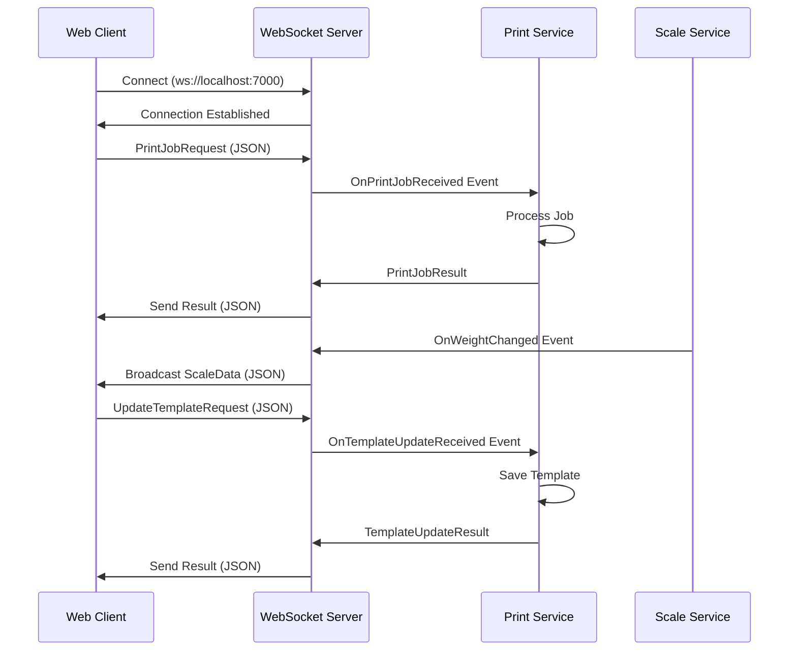

## Overview

APM runs a local WebSocket server that enables real-time communication between web applications (Appsiel Cloud POS) and the local print manager. The server listens on **port 7000** and handles print job requests, scale data streaming, and template updates.

## Server Architecture

<Info>
The WebSocket server uses the **WatsonWebsocket** library for reliable connection management and message handling.
</Info>

### Server Endpoint

```
ws://localhost:7000
ws://127.0.0.1:7000
ws://[local-ip]:7000  (for same-network access)
```

## Service Interface

```csharp Core/Interfaces/IWebSocketService.cs
public interface IWebSocketService
{
    // Server lifecycle
    Task StartServerAsync(int port);
    Task StopServerAsync();
    
    // Server state
    bool IsRunning { get; }
    int CurrentClientCount { get; }
    
    // Client events
    event AsyncEventHandler<string> OnClientConnected;
    event AsyncEventHandler<string> OnClientDisconnected;
    
    // Message events
    event AsyncEventHandler<WebSocketMessageReceivedEventArgs<PrintJobRequest>> OnPrintJobReceived;
    event AsyncEventHandler<WebSocketMessageReceivedEventArgs<PrintTemplate>> OnTemplateUpdateReceived;
    
    // Outbound messaging
    Task SendPrintJobResultToAllClientsAsync(PrintJobResult result);
    Task SendPrintJobResultToClientAsync(string clientId, PrintJobResult result);
    Task SendScaleDataToAllClientsAsync(ScaleData scaleData);
    Task SendTemplateUpdateResultAsync(string clientId, TemplateUpdateResult result);
}
```

## Server Initialization

The server starts during application initialization:

```csharp Infraestructure/Services/AndroidWebSocketService.cs:84-134
public Task StartServerAsync(int port)
{
    lock (_lockObject)
    {
        if (_server != null)
        {
            _logger.LogWarning("El servidor WebSocket ya está en ejecución.");
            return Task.CompletedTask;
        }
        
        // Create Watson WebSocket server instance
        // Listen on all interfaces ("+") to allow external connections
        // Parameters: IP, Port, SSL enabled
        _server = new WatsonWsServer("+", port, false);
        
        // Subscribe to server events
        _server.ClientConnected += OnWatsonClientConnected;
        _server.ClientDisconnected += OnWatsonClientDisconnected;
        _server.MessageReceived += OnWatsonMessageReceived;
        
        // Start the server
        _server.Start();
        
        _logger.LogInfo($"Servidor WebSocket iniciado en puerto {port}");
    }
    
    return Task.CompletedTask;
}
```

<Warning>
The server binds to all network interfaces (`"+"`) to enable access from web browsers on the same machine and local network. Ensure firewall rules allow inbound connections on port 7000.
</Warning>

## Client Connection Management

### Connection Events

```csharp Infraestructure/Services/AndroidWebSocketService.cs:314-344
private void OnWatsonClientConnected(object? sender, ConnectionEventArgs args)
{
    lock (_lockObject)
    {
        _currentClientCount++;
    }
    
    var clientId = args.Client.Guid.ToString();
    _logger.LogInfo($"Cliente conectado: {clientId} desde {args.Client.IpPort}");
    
    // Fire interface event
    OnClientConnected?.Invoke(this, clientId);
}

private void OnWatsonClientDisconnected(object? sender, DisconnectionEventArgs args)
{
    lock (_lockObject)
    {
        _currentClientCount--;
        if (_currentClientCount < 0) _currentClientCount = 0;
    }
    
    var clientId = args.Client.Guid.ToString();
    _logger.LogInfo($"Cliente desconectado: {clientId}");
    
    OnClientDisconnected?.Invoke(this, clientId);
}
```

## Message Protocol

### Inbound Messages

The server accepts JSON messages and automatically deserializes them based on content:

#### Print Job Request

```json
{
  "JobId": "job_20260303_143522",
  "PrinterId": "thermal_kitchen",
  "DocumentType": "ticket_venta",
  "Document": {
    "Sale": {
      "Number": "VTA-001234",
      "Total": 125.50,
      "Items": [
        {
          "ProductName": "Producto A",
          "Quantity": 2,
          "Total": 50.00
        }
      ]
    },
    "Store": {
      "Name": "Mi Tienda",
      "Address": "Calle Principal 123"
    }
  }
}
```

#### Template Update Request

```json
{
  "Action": "UpdateTemplate",
  "Template": {
    "TemplateId": "tpl_001",
    "Name": "Plantilla Estándar",
    "DocumentType": "ticket_venta",
    "Sections": [
      {
        "Name": "Header",
        "Type": "Static",
        "Elements": [
          {
            "Type": "Text",
            "StaticValue": "MI TIENDA",
            "Format": "Bold Size2"
          }
        ]
      }
    ]
  }
}
```

### Message Processing

```csharp Infraestructure/Services/AndroidWebSocketService.cs:350-403
private void OnWatsonMessageReceived(object? sender, MessageReceivedEventArgs args)
{
    try
    {
        var clientId = args.Client.Guid.ToString();
        var message = Encoding.UTF8.GetString(args.Data.ToArray());
        
        _logger.LogInfo($"Mensaje recibido de {clientId}: {message}");
        
        // Attempt to deserialize as PrintJobRequest
        var request = JsonSerializer.Deserialize<PrintJobRequest>(message, new JsonSerializerOptions
        {
            PropertyNameCaseInsensitive = true
        });
        
        if (request != null && !string.IsNullOrEmpty(request.JobId))
        {
            _logger.LogInfo($"PrintJobRequest deserializado para JobId: {request.JobId}");
            
            // Fire event with ClientId
            var eventArgs = new WebSocketMessageReceivedEventArgs<PrintJobRequest>(clientId, request);
            OnPrintJobReceived?.Invoke(this, eventArgs);
        }
        else
        {
            // Check if it's a template update
            using (JsonDocument doc = JsonDocument.Parse(message))
            {
                if (doc.RootElement.TryGetProperty("Action", out JsonElement actionProp) &&
                    string.Equals(actionProp.GetString(), "UpdateTemplate", StringComparison.OrdinalIgnoreCase))
                {
                    var updateReq = JsonSerializer.Deserialize<UpdateTemplateRequest>(message, 
                        new JsonSerializerOptions { PropertyNameCaseInsensitive = true });
                    
                    if (updateReq?.Template != null)
                    {
                        _logger.LogInfo($"UpdateTemplateRequest recibido de {clientId}");
                        var updateArgs = new WebSocketMessageReceivedEventArgs<PrintTemplate>(clientId, updateReq.Template);
                        OnTemplateUpdateReceived?.Invoke(this, updateArgs);
                        return;
                    }
                }
            }
            
            _logger.LogWarning($"No se pudo procesar el mensaje: {message}");
        }
    }
    catch (JsonException jex)
    {
        _logger.LogError($"Error de deserialización JSON: {jex.Message}", jex);
    }
}
```

## Outbound Messages

### Print Job Result (Broadcast)

```csharp Infraestructure/Services/AndroidWebSocketService.cs:182-224
public async Task SendPrintJobResultToAllClientsAsync(PrintJobResult result)
{
    if (_server == null)
    {
        _logger.LogWarning("No se puede enviar PrintJobResult, el servidor no está en ejecución.");
        return;
    }
    
    try
    {
        var json = JsonSerializer.Serialize(result);
        var clients = _server.ListClients();
        
        if (clients == null || !clients.Any())
        {
            _logger.LogWarning("No hay clientes conectados para enviar PrintJobResult.");
            return;
        }
        
        foreach (var client in clients)
        {
            try
            {
                await _server.SendAsync(client.Guid, json);
                _logger.LogInfo($"PrintJobResult enviado al cliente {client.Guid}");
            }
            catch (Exception ex)
            {
                _logger.LogError($"Error al enviar PrintJobResult al cliente {client.Guid}: {ex.Message}");
            }
        }
    }
    catch (Exception ex)
    {
        _logger.LogError($"Error al serializar o enviar PrintJobResult: {ex.Message}");
    }
}
```

Clients receive:

```json
{
  "JobId": "job_20260303_143522",
  "Status": "DONE",
  "ErrorMessage": null
}
```

Or on error:

```json
{
  "JobId": "job_20260303_143522",
  "Status": "ERROR",
  "ErrorMessage": "Impresora con ID 'thermal_kitchen' no encontrada o no configurada."
}
```

### Print Job Result (Unicast)

```csharp Infraestructure/Services/AndroidWebSocketService.cs:229-260
public async Task SendPrintJobResultToClientAsync(string clientId, PrintJobResult result)
{
    if (_server == null)
    {
        _logger.LogWarning("No se puede enviar PrintJobResult, el servidor no está en ejecución.");
        return;
    }
    
    try
    {
        // Convert string clientId to Guid
        if (!Guid.TryParse(clientId, out var clientGuid))
        {
            _logger.LogError($"Client ID inválido: {clientId}");
            return;
        }
        
        var json = JsonSerializer.Serialize(result);
        await _server.SendAsync(clientGuid, json);
        _logger.LogInfo($"PrintJobResult enviado al cliente específico {clientId}");
    }
    catch (Exception ex)
    {
        _logger.LogError($"Error al enviar PrintJobResult al cliente {clientId}: {ex.Message}");
    }
}
```

### Scale Data Broadcast

```csharp
public async Task SendScaleDataToAllClientsAsync(ScaleData scaleData)
{
    var json = JsonSerializer.Serialize(scaleData);
    var clients = _server.ListClients();
    
    foreach (var client in clients)
    {
        await _server.SendAsync(client.Guid, json);
    }
}
```

Clients receive real-time weight updates:

```json
{
  "Type": "SCALE_READING",
  "StationId": "Local",
  "ScaleId": "scale_001",
  "Weight": 15.75,
  "Unit": "kg",
  "Stable": true,
  "Timestamp": "2026-03-03T14:35:22.123Z"
}
```

### Template Update Result

```csharp Infraestructure/Services/AndroidWebSocketService.cs:265-295
public async Task SendTemplateUpdateResultAsync(string clientId, TemplateUpdateResult result)
{
    if (_server == null)
    {
        _logger.LogWarning("No se puede enviar TemplateUpdateResult, el servidor no está en ejecución.");
        return;
    }
    
    try
    {
        if (!Guid.TryParse(clientId, out var clientGuid))
        {
            _logger.LogError($"Client ID inválido para TemplateUpdateResult: {clientId}");
            return;
        }
        
        var json = JsonSerializer.Serialize(result);
        await _server.SendAsync(clientGuid, json);
        _logger.LogInfo($"TemplateUpdateResult enviado al cliente {clientId}");
    }
    catch (Exception ex)
    {
        _logger.LogError($"Error al enviar TemplateUpdateResult al cliente {clientId}: {ex.Message}");
    }
}
```

## Event Flow Diagram



## Client ID Management

Each connected client receives a unique GUID identifier:

```csharp
public class WebSocketMessageReceivedEventArgs<T> : EventArgs
{
    public string ClientId { get; }  // Client's unique GUID
    public T Message { get; }        // Deserialized message
    
    public WebSocketMessageReceivedEventArgs(string clientId, T message)
    {
        ClientId = clientId;
        Message = message;
    }
}
```

This enables:
- Targeted responses to specific clients
- Request/response correlation
- Per-client session management

## Server Shutdown

```csharp Infraestructure/Services/AndroidWebSocketService.cs:140-175
public Task StopServerAsync()
{
    lock (_lockObject)
    {
        if (_server == null)
        {
            _logger.LogWarning("El servidor WebSocket no está en ejecución.");
            return Task.CompletedTask;
        }
        
        try
        {
            // Unsubscribe from events to prevent memory leaks
            _server.ClientConnected -= OnWatsonClientConnected;
            _server.ClientDisconnected -= OnWatsonClientDisconnected;
            _server.MessageReceived -= OnWatsonMessageReceived;
            
            // Stop the server
            _server.Stop();
            _server.Dispose();
            
            _logger.LogInfo("Servidor WebSocket detenido.");
        }
        catch (Exception ex)
        {
            _logger.LogError($"Error al detener el servidor WebSocket: {ex.Message}");
        }
        finally
        {
            _server = null!;
            _currentClientCount = 0;
        }
    }
    
    return Task.CompletedTask;
}
```

## JavaScript Client Example

```javascript
class APMClient {
  constructor() {
    this.ws = null;
    this.callbacks = {};
  }
  
  connect() {
    this.ws = new WebSocket('ws://localhost:7000');
    
    this.ws.onopen = () => {
      console.log('Connected to APM');
    };
    
    this.ws.onmessage = (event) => {
      const data = JSON.parse(event.data);
      
      if (data.JobId) {
        // Print job result
        this.handlePrintResult(data);
      } else if (data.Type === 'SCALE_READING') {
        // Scale data
        this.handleScaleData(data);
      }
    };
    
    this.ws.onerror = (error) => {
      console.error('WebSocket error:', error);
    };
    
    this.ws.onclose = () => {
      console.log('Disconnected from APM');
      // Reconnect logic
      setTimeout(() => this.connect(), 3000);
    };
  }
  
  async printTicket(printerId, documentType, document) {
    const request = {
      JobId: `job_${Date.now()}`,
      PrinterId: printerId,
      DocumentType: documentType,
      Document: document
    };
    
    return new Promise((resolve, reject) => {
      this.callbacks[request.JobId] = { resolve, reject };
      this.ws.send(JSON.stringify(request));
      
      // Timeout after 10 seconds
      setTimeout(() => {
        if (this.callbacks[request.JobId]) {
          delete this.callbacks[request.JobId];
          reject(new Error('Print request timeout'));
        }
      }, 10000);
    });
  }
  
  handlePrintResult(result) {
    const callback = this.callbacks[result.JobId];
    if (callback) {
      delete this.callbacks[result.JobId];
      
      if (result.Status === 'DONE') {
        callback.resolve(result);
      } else {
        callback.reject(new Error(result.ErrorMessage));
      }
    }
  }
  
  handleScaleData(data) {
    // Update UI with weight
    document.getElementById('weight-display').textContent = 
      `${data.Weight} ${data.Unit}`;
  }
}

// Usage
const apm = new APMClient();
apm.connect();

// Print a sales ticket
await apm.printTicket('thermal_kitchen', 'ticket_venta', {
  Sale: {
    Number: 'VTA-001234',
    Total: 125.50,
    Items: [/* ... */]
  }
});
```

## Security Considerations

<Warning>
The WebSocket server runs **without SSL/TLS** (`ws://` not `wss://`) for local development simplicity. It's designed for same-machine or trusted local network access only.
</Warning>

### Firewall Configuration

For network access, configure Windows Firewall:

```powershell
New-NetFirewallRule -DisplayName "APM WebSocket Server" `
  -Direction Inbound `
  -LocalPort 7000 `
  -Protocol TCP `
  -Action Allow
```

### Access Control

The server binds to all interfaces (`"+"`) but you can restrict to localhost:

```csharp
// Localhost only
_server = new WatsonWsServer("127.0.0.1", port, false);

// Specific IP only
_server = new WatsonWsServer("192.168.1.100", port, false);
```

## Troubleshooting

<AccordionGroup>
  <Accordion title="Connection refused">
    - Verify APM is running and server started successfully
    - Check logs for "Servidor WebSocket iniciado en puerto 7000"
    - Ensure port 7000 is not blocked by firewall
    - Try `netstat -an | findstr :7000` to verify port is listening
  </Accordion>
  
  <Accordion title="Messages not received">
    - Verify JSON format is valid
    - Check required fields are present (JobId, PrinterId, DocumentType)
    - Review server logs for deserialization errors
    - Ensure PropertyNameCaseInsensitive handles field name variations
  </Accordion>
  
  <Accordion title="Results not sent back">
    - Verify client is still connected when result is ready
    - Check that ClientId matches between request and response
    - Review logs for send errors
    - Ensure client has message handler for response format
  </Accordion>
</AccordionGroup>

## Next Steps

<CardGroup cols={2}>
  <Card title="Printer Management" icon="print" href="/features/printer-management">
    Configure printers to process incoming jobs
  </Card>
  <Card title="Template System" icon="file-code" href="/features/template-system">
    Design print templates for documents
  </Card>
  <Card title="Scale Integration" icon="weight-scale" href="/features/scale-integration">
    Set up scales for real-time weight streaming
  </Card>
</CardGroup>