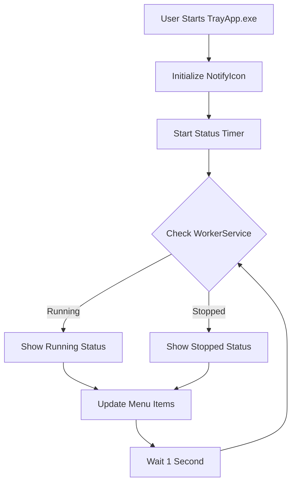

The APM Tray Application runs in your Windows system tray, providing quick access to start, stop, and monitor the WorkerService and UI application.

## What is the Tray Application?

The tray app is a lightweight Windows application that:
- Displays the WorkerService status in real-time
- Allows starting and stopping the WorkerService process
- Provides quick access to the APM UI
- Runs on Windows startup (optional)
- Lives in the system tray (notification area)

<Frame>
  
</Frame>

## Starting the Tray Application

<Steps>
  <Step title="Launch TrayApp.exe">
    Navigate to your APM installation directory and run `TrayApp.exe`.
    
    Default location: `C:\Program Files\AppsielPrintManager\trayapp\TrayApp.exe`
  </Step>

  <Step title="Find the Tray Icon">
    Look for the APM icon in your Windows system tray (bottom-right corner of screen).
    
    If hidden, click the **^** arrow to show hidden icons.
  </Step>

  <Step title="Access the Menu">
    Right-click the tray icon to open the context menu.
  </Step>
</Steps>

## Tray Menu Options

Right-click the tray icon to access:

| Menu Item | Description |
|-----------|-------------|
| **Abrir UI** | Opens the APM user interface application |
| **Estado: [Status]** | Displays current WorkerService status (read-only) |
| **Iniciar WorkerService** | Starts the WorkerService process |
| **Detener WorkerService** | Stops the WorkerService process |
| **Salir** | Exits the tray app and stops WorkerService |

## WorkerService Status Indicators

The status menu item shows the current state:

<Tabs>
  <Tab title="En Ejecución">
    **Status:** Running ✓  
    **Icon:** Green indicator
    
    The WorkerService is active and processing print jobs.
    
    Available actions:
    - **Detener WorkerService** (enabled)
    - **Iniciar WorkerService** (disabled)
  </Tab>

  <Tab title="Detenido">
    **Status:** Stopped ⚪  
    **Icon:** Red indicator
    
    The WorkerService is not running.
    
    Available actions:
    - **Iniciar WorkerService** (enabled)
    - **Detener WorkerService** (disabled)
  </Tab>

  <Tab title="Desconocido">
    **Status:** Unknown ⚪  
    **Icon:** White indicator
    
    Cannot determine WorkerService state.
    
    This may occur if:
    - WorkerService was never started
    - Process crashed unexpectedly
    - Permissions issue checking process status
  </Tab>
</Tabs>

<Note>
  The status updates automatically every 1 second to reflect the current state.
</Note>

## Using the Tray Application

### Opening the UI

<Steps>
  <Step title="Right-click Tray Icon">
    Right-click the APM tray icon in the system tray.
  </Step>

  <Step title="Select Abrir UI">
    Click **Abrir UI** from the menu.
  </Step>

  <Step title="Wait for UI Launch">
    The MAUI UI application will launch in a new window.
    
    A confirmation message appears when the UI starts successfully.
  </Step>
</Steps>

<Warning>
  If the UI is already running, you'll see a message: "La UI de Appsiel Print Manager ya está en ejecución."
</Warning>

### Starting the WorkerService

<Steps>
  <Step title="Check Status">
    Ensure the status shows **Detenido** (stopped).
  </Step>

  <Step title="Click Iniciar WorkerService">
    Select **Iniciar WorkerService** from the menu.
  </Step>

  <Step title="Verify Started">
    Wait for the confirmation message and check that status changes to **En Ejecución**.
  </Step>
</Steps>

The WorkerService will:
- Start as a background process
- Begin listening for print jobs
- Connect to configured printers and scales
- Run without a visible window

### Stopping the WorkerService

<Steps>
  <Step title="Check Status">
    Ensure the status shows **En Ejecución** (running).
  </Step>

  <Step title="Click Detener WorkerService">
    Select **Detener WorkerService** from the menu.
  </Step>

  <Step title="Verify Stopped">
    The process will terminate and status will change to **Detenido**.
  </Step>
</Steps>

<Warning>
  Stopping the WorkerService will interrupt any in-progress print jobs.
</Warning>

### Exiting the Tray Application

<Steps>
  <Step title="Select Salir">
    Right-click the tray icon and select **Salir**.
  </Step>

  <Step title="Automatic Cleanup">
    The tray app will automatically:
    1. Stop the WorkerService if running
    2. Close the UI if open
    3. Remove the tray icon
    4. Exit completely
  </Step>
</Steps>

<Note>
  Exiting the tray app does NOT uninstall APM - it simply stops the current session.
</Note>

## Automatic Startup

To run the tray app automatically when Windows starts:

<Steps>
  <Step title="Open Startup Folder">
    Press `Win + R`, type `shell:startup`, and press Enter.
  </Step>

  <Step title="Create Shortcut">
    Right-click in the Startup folder and select **New > Shortcut**.
  </Step>

  <Step title="Set Target">
    Browse to `TrayApp.exe` in your APM installation directory.
    
    Example: `C:\Program Files\AppsielPrintManager\trayapp\TrayApp.exe`
  </Step>

  <Step title="Name Shortcut">
    Name it "Appsiel Print Manager" and click **Finish**.
  </Step>

  <Step title="Restart to Test">
    Restart Windows and verify the tray icon appears automatically.
  </Step>
</Steps>

## How the Tray App Works

The tray application uses the following logic to manage services:

### WorkerService Discovery

The app searches for `WorkerService.exe` in:

1. **Production path:** `../worker/WorkerService.exe` (relative to tray app)
2. **Development paths:** Various `bin/Debug` and `bin/Release` folders

### UI Discovery

The app searches for `UI.exe` in:

1. **Production path:** `../UI.exe` (relative to tray app)
2. **Development paths:** Various `bin/Debug` and `bin/Release` folders

### Status Monitoring

Every 1 second, the tray app:
- Checks if `WorkerService.exe` process is running
- Optionally checks Windows Service status (if installed as service)
- Updates menu status and icon
- Enables/disables menu items accordingly

## Troubleshooting

<AccordionGroup>
  <Accordion title="Tray icon not appearing">
    - Check if TrayApp.exe is running in Task Manager
    - Look in hidden icons (click ^ in system tray)
    - Restart TrayApp.exe with administrator privileges
    - Check Windows notification settings allow tray icons
  </Accordion>

  <Accordion title="WorkerService won't start">
    - Verify WorkerService.exe exists in the expected path
    - Check for error messages in the tray app popup
    - Ensure no other instance is already running (check Task Manager)
    - Try running WorkerService.exe directly to see detailed errors
  </Accordion>

  <Accordion title="UI won't open">
    - Verify UI.exe exists in the expected path
    - Check if UI is already running (only one instance allowed)
    - Ensure .NET runtime is installed for MAUI applications
    - Check Windows Event Viewer for application errors
  </Accordion>

  <Accordion title="Status always shows 'Desconocido'">
    - The tray app may not have permission to query process status
    - Run TrayApp.exe as administrator
    - Check if Windows Service controller is accessible
  </Accordion>

  <Accordion title="Tray app exits on startup">
    - Check for error dialogs that appear briefly
    - Run from Command Prompt to see console errors
    - Verify all required DLLs are present
    - Check Application Event Log for crash details
  </Accordion>
</AccordionGroup>

## Files and Locations

| File | Purpose | Default Location |
|------|---------|------------------|
| `TrayApp.exe` | Main tray application | `C:\Program Files\AppsielPrintManager\trayapp\` |
| `apmtrayicon.ico` | Tray icon graphic | `C:\Program Files\AppsielPrintManager\trayapp\Resources\` |
| `WorkerService.exe` | Background service | `C:\Program Files\AppsielPrintManager\worker\` |
| `UI.exe` | MAUI user interface | `C:\Program Files\AppsielPrintManager\` |

## Technical Details

### Implementation

- **Platform:** .NET 10 WPF (Windows-only)
- **Tray Framework:** `System.Windows.Forms.NotifyIcon`
- **Process Management:** `System.Diagnostics.Process`
- **Service Control:** `System.ServiceProcess.ServiceController`
- **Update Frequency:** 1 second polling timer

### Process Lifecycle

## Related Documentation

<CardGroup cols={2}>
  <Card title="Installation Guide" icon="download" href="/quickstart">
    Installing APM on Windows
  </Card>
  <Card title="Printer Configuration" icon="printer" href="/guides/printer-configuration">
    Configure printers and devices
  </Card>
</CardGroup>