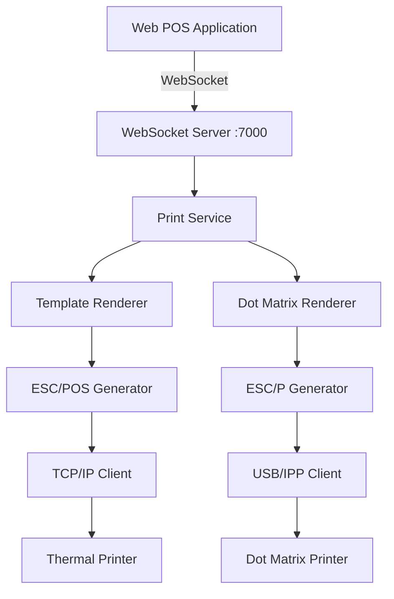

## What is Appsiel Print Manager?

Appsiel Print Manager (APM) is a robust print management system designed for Point of Sale (POS) environments. It bridges web-based POS applications with thermal and dot matrix printers through a WebSocket server, enabling real-time print job processing and template-based document generation.

APM consists of two main components:

<CardGroup cols={2}>
  <Card title="Windows Service" icon="server" href="/installation#windows-service">
    Background service that handles WebSocket connections and print job processing on port 7000
  </Card>
  <Card title="MAUI Application" icon="mobile-screen" href="/installation#maui-application">
    Cross-platform UI for managing printers, templates, and monitoring print jobs
  </Card>
</CardGroup>

## Key features

<CardGroup cols={2}>
  <Card title="WebSocket communication" icon="plug">
    Real-time bidirectional communication between web clients and the print server
  </Card>
  <Card title="Template-based printing" icon="file-code">
    Flexible JSON templates with support for static sections, tables, and repeated elements
  </Card>
  <Card title="Multiple printer types" icon="print">
    Support for thermal (ESC/POS) and dot matrix (ESC/P) printers via TCP, USB, or IPP
  </Card>
  <Card title="Scale integration" icon="scale-balanced">
    Serial scale support for weight-based products with real-time data streaming
  </Card>
  <Card title="Rich document types" icon="receipt">
    Pre-built templates for sales tickets, kitchen orders, invoices, stickers, and more
  </Card>
  <Card title="Remote template updates" icon="cloud-arrow-up">
    Update print templates from web applications without restarting the service
  </Card>
</CardGroup>

## Architecture overview

APM follows a layered architecture pattern:



<Note>
  The Windows Service runs as a background process, while the MAUI app provides configuration and monitoring capabilities. Both can run independently.
</Note>

## How it works

<Steps>
  <Step title="Client connects">
    Your web application establishes a WebSocket connection to `ws://localhost:7000/websocket/`
  </Step>
  <Step title="Send print job">
    Send a `PrintJobRequest` JSON message containing document type, printer ID, and data
  </Step>
  <Step title="Template rendering">
    APM matches the document type to a template and renders the data using the template sections
  </Step>
  <Step title="Command generation">
    The renderer generates ESC/POS or ESC/P commands based on the printer type
  </Step>
  <Step title="Print output">
    Commands are sent to the printer via the configured connection (TCP, USB, or IPP)
  </Step>
  <Step title="Result notification">
    A `PrintJobResult` is sent back to the client with success/error status
  </Step>
</Steps>

## Document types

APM includes default templates for common POS documents:

| Document Type | Description | Use Case |
| --- | --- | --- |
| `ticket_venta` | Sales receipt | Point of sale transactions |
| `comanda` | Kitchen order | Restaurant order tickets |
| `factura_electronica` | Electronic invoice | Formal invoicing with tax details |
| `sticker_codigo_barras` | Barcode sticker | Product labeling |
| `comprobante_egreso` | Payment voucher | Cash disbursements |

<Warning>
  Template definitions are stored as JSON files in the application data folder. Always backup templates before making changes.
</Warning>

## WebSocket message types

APM handles several message types over the WebSocket connection:

<CodeGroup>
```json PrintJobRequest
{
  "JobId": "SALE-12345",
  "StationId": "CAJA_1",
  "PrinterId": "printer_main",
  "DocumentType": "ticket_venta",
  "Document": {
    "company": { ... },
    "sale": { ... },
    "footer": []
  }
}
```

```json PrintJobResult
{
  "JobId": "SALE-12345",
  "Status": "DONE",
  "ErrorMessage": null
}
```

```json ScaleData
{
  "ScaleId": "scale_001",
  "Weight": 1.250,
  "Unit": "kg",
  "Stable": true,
  "Timestamp": "2026-03-03T10:30:00Z"
}
```
</CodeGroup>

Refer to `/home/daytona/workspace/source/Core/Models/PrintJobRequest.cs:1` for the complete model definition.

## Technology stack

<CardGroup cols={3}>
  <Card title=".NET 10" icon="microsoft">
    Core runtime and libraries
  </Card>
  <Card title=".NET MAUI" icon="mobile">
    Cross-platform UI framework
  </Card>
  <Card title="WebSockets" icon="network-wired">
    Real-time communication protocol
  </Card>
</CardGroup>

## Next steps

<CardGroup cols={2}>
  <Card title="Installation" icon="download" href="/installation">
    Install the Windows Service and MAUI application
  </Card>
  <Card title="Quick start" icon="rocket" href="/quickstart">
    Send your first print job in minutes
  </Card>
</CardGroup>